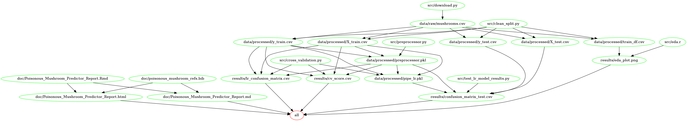

# Poisonous Mushroom Predictor
Contributors: 

- Dongxiao Li
- Kyle Maj
- Mahmoodur Rahman

Data analysis project executed by Group 4.0 of 6th Cohort (2021-22) for DSCI 522 (Data Science workflows); a course in the Master of Data Science program at the University of British Columbia.

A project proposal is discussed [here](https://github.com/UBC-MDS/Poisonous_Mushroom_Predictor/blob/main/doc/proposal.md).

## Background
Mushrooms are species of fungus, of which some can be eaten with meaty texture and few types are toxic [^1]. Annually, a significant number of people die from ingesting poisonous mushrooms [^2],[^3]. The BC Centre for Disease Control (BCCDC) received 200 calls relating to mushroom poisoning in 2018 [^4]. Thus, It is critical to recognize a mushroom of poisonous species by observing it's appearance. By appearance, primarily it refers to certain physical traits. A model recognizing mushroom toxicity by taking these physical traits into account can be effective at preventing mushroom toxicity [^5]. Recent methods on classifying mushroom falls into three groups, chemical determination, animal experimentation, fungal classification and folk experience [^6]. These methods are not perfect and there is room for improvement [^7]. Mankind has been identifying toxic mushrooms by observing morphology, smell and distinct features [^8]. These intuitive-based methods are less reliable, and often lead to fatal incidents. However, relying on these experiences and intuitions, machine-learning models can be tried and tested. In this era of fourth Industrial revolution, artificial intelligence is playing a major role through deployment of machine-learning and deep learning model [^9]. This also made it's way to detecting poisonous muashroom also. Chaoqun and colleagues developed an android-based application, which detects toxic mushrooms through machine-learning models [^10]. To further improve classification, decision fusion method has been used, by stacking algorythms [^11]. Shuaichang and colleagues used image-based models for poisonous mushroom detection [^12].

## About
In this project, we first randomly splitted the raw data file into a train dataset(80%) and a test dataset(20%), after performing tabular and visual exploratory analysis on the train dataset, we dropped one feature that only has one class and dealt with missing values in the model fitting process. We obtained baseline predictions from fitting Dummy classifiers on training data. We also ran Logistic Regression. We interpreted certain evaluation matrices such as Confusion matrix with cross-validation, Precision, Recall, and f1 score. Eventually, after tuning the model with cross validation, we reached a decision on the model we used. We also checked class imbalance and sample size issues as the sanity check.

Our project summary workflow is shown here:



## Data

Data used in this project is from UCI machine learning repository, provided by Jeff Schlimmer of the Audubon Society Field Guide to North American Mushrooms [^13]. The dataset has 8124 examples and 22 features with 2 possible target classes (edible and poisonous). The features are: cap shape, cap surface, cap color, bruises, odor, gill spacing, gill attachment, gill size, gill color, stalk shape, stalk root, stalk surface above ring, stalk surface below ring, stalk color above ring, stalk color below ring, veil type, veil color, ring number, ring type, spore print color, population, and habitat.

## Report
The final report can be found [here](https://github.com/UBC-MDS/Poisonous_Mushroom_Predictor/blob/main/doc/Poisonous_Mushroom_Predictor_Report.md).

## Usage

To replicate the analysis, clone this GitHub repository, install and activate the environment file listed below, and run the following command at the command line/terminal from the root directory of this project:

```
make all
```
To reset the repo to a clean state, with no intermediate or results files that are needed to generate the final report, run the following command at the command line/terminal from the root directory of this project:

```
make clean
```


Original commands for scripts needed(they are all included in the [Makefile](https://github.com/UBC-MDS/Poisonous_Mushroom_Predictor/blob/main/Makefile)):

```
# download mushrooms data set to directory
python src/download.py --url="https://raw.githubusercontent.com/kanchitank/Mushroom-Classification/master/mushrooms.csv" --out_file=data/raw/mushrooms.csv

# preliminary eda using pandas_profiling pacakge
python src/preliminary_pandas_eda.py --data=data/processed/train_df.csv --out_html=results/pandas_preliminary_eda_mushrooms.html

# clean and split the raw data into test and train parts and write to assigned directory
python src/clean_split.py --input_csv="data/raw/mushrooms.csv" --out_dir="data/processed/"

# create a preprocessor to transform the train data that can be passed to the next script
python src/preprocessor.py --X_train_input='data/processed/X_train.csv' --y_train_input='data/processed/X_train.csv' --out_pkl='data/processed/preprocessor.pkl'

# cross validation and confusion matrix on train data
python src/cross_validation.py --X_train_input='data/processed/X_train.csv' --y_train_input='data/processed/y_train.csv' --out_cv='results/cv_score.csv' --out_matrix='results/lr_confusion_matrix.csv' --out_pkl='data/processed/pipe_lr.pkl'

# test the model and output results(confusion matrix)
python src/test_lr_model_results.py --X_test_input='data/processed/X_test.csv' --y_test_input='data/processed/y_test.csv' --out_matrix_test='results/confusion_matrix_test.csv' 

```
## Dependencies
This list will continue to be modified during the project.

To set up the necessary packages for running the data analysis materials from poisonous mushroom prediction, download the environment file from the repo to your computer (hit "Raw" and the Ctrl + s to save it, or copy paste the content). Then create a Python virtual environment by using conda with the environment file you just downloaded:
```
conda env create -f env-mushroom.yaml
conda activate mushroom
```

Python 3.7.3 and Python packages:

- docopt==0.6.2

- requests==2.22.0

- pandas==0.24.2

R version 4.0.2. and R packages:

- knitr==1.30

- feather==0.3.5

- kableExtra==1.3.1

- tidyverse==1.3.0

- docopt==0.6.2

  
## License
The Poisonous Mushroom Prediction materials here are licensed under the Creative Commons Attribution 2.5 Canada License (CC BY 2.5 CA). If re-using/re-mixing please provide attribution and link to this webpage.


## Reference

[^1]: J. H. Tegzes and B. Puschner, ““Toxic mushrooms,” the veterinary 
clinics of north America,” Veterinary Clinics of North America: Small 
Animal Practice, vol. 32, no. 2, pp. 397–407, 2002. 
[^2]: C. Lei, W. Tangkanakul, and L. Lu, “Mushroom poisoning surveillance 
analysis,” OSIR Journal, vol. 1, no. 1, pp. 8–11, 2006. 
[^3]: J. White, S. A. Weinstein, L. De Haro et al., “Mushroom poisoning: a 
proposed new clinical classification,” Toxicon, vol. 157, pp. 53–65, 2019. 
[^4]: [http://www.bccdc.ca/about/news-stories/stories/mushroom-poisonings-on-the-rise-in-british-columbia ](http://www.bccdc.ca/about/news-stories/stories/mushroom-poisonings-on-the-rise-in-british-columbia) 
[^5]: J. H. Diaz, “Evolving global epidemiology, syndromic classification, 
general management, and prevention of unknown mushroom poisonings,” Critical 
Care Medicine, vol. 33, no. 2, pp. 419–426, 2005. 
[^6]: T. Fukuwatari, E. Sugimoto, K. Yokoyama, and K. Shibata, “Establishment 
of animal model for elucidating the mechanism of intoxication by the poisonous 
mushroom Clitocybe acromelalga,” Journal of the Food Hygienic Society of Japan 
(Shokuhin Eiseigaku Zasshi), vol. 42, no. 3, pp. 185–189, 2001.
[^7]: M. Lu, “Present status and future prospects of the mushroom industry in 
China,” Acta Edulis Fungi, vol. 13, no. 1, pp. 1–5, 2006.
[^8]: K. Tanaka, S. Miyasaka, and T. Inoue, “Histopathological effects of 
illudin S, a toxic substance of poisonous mushroom, in rat,” Human & Experimental 
Toxicology, vol. 15, no. 4, pp. 289–293, 1996.
[^9]: W. A. Reynolds and F. H. Lowe, “Mushrooms and a toxic reaction to alcohol,” 
New England Journal of Medicine, vol. 272, no. 12, pp. 630-631, 1965. 
[^10]: Z. Chaoqun, Recognition and Research of Poisonous Mushroom Based on Machine 
Learning, Taigu: Shanxi Agricultural University, Jinzhong, China, 2019.
[^11]: Y. Zhifeng, Application of Multi-Classifier Fusion Based on Stacking 
Algorithm in Identification of Poisonous Mushrooms, Taigu: Shanxi Agricultural 
University, Jinzhong, China, 2019. 
[^12]: F. Shuaichang, Y. Xiaomei, and L. Jian, “Toadstool image recognition based 
on deep residual network and transfer learning,” Journal of Transduction Technology, 
vol. 33, no. 1, pp. 74–83, 2020. 
[^13]: [https://archive-beta.ics.uci.edu/ml/datasets/mushroom ](https://archive-beta.ics.uci.edu/ml/datasets/mushroom) 
