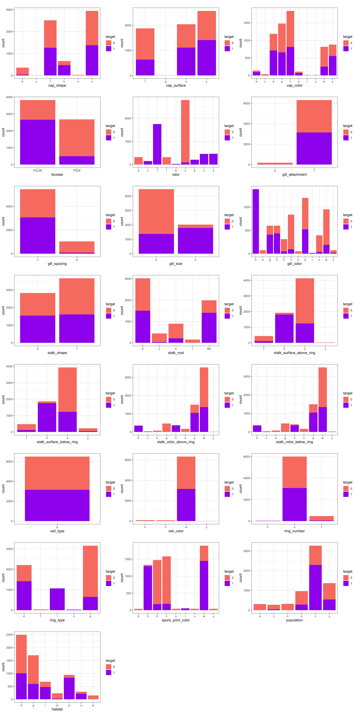

Predicting poisonous mushroom from morphologocal characteristics
================
Group 4 - Dongxiao Li, Kyle Maj, Mahmoodur Rahman
2020/11/26 (updated: 2021-12-04)

-   [Summary](#summary)
-   [Introduction](#introduction)
-   [Methods](#methods)
    -   [Data](#data)
    -   [Analysis](#analysis)
        -   [Exploration](#exploration)
        -   [Prediction](#prediction)
-   [Limitations & Assumptions](#limitations--assumptions)
-   [Looking Forward](#looking-forward)
-   [References](#references)

# Summary

As mushrooms have distinctive characteristics which help in identifying
whether they are poisons or edible. In this project we have built a
logistic regression classification model which can use several
morphological characteristics of mushrooms to predict whether an
observed mushroom is toxic or edible (non-toxic). Exploratory data
analysis revealed definite distinctions between our target classes, as
well as highlighting several key patterns which could serve as strong
predictors. On the test data set of 1,625 observations our model
performed extremely well with a 99% recall score and a 100% precision
score. The model correctly classified 863 edible and 761 toxic
mushrooms. One false negative result was produced (toxic mushroom
identified as non-toxic). In the context of this problem, a false
negative could result in someone being seriously or even fatally
poisoned. We must therefore be far more concerned with minimizing false
negatives than false positives. Given this precedent, we may consider
tuning the threshold of our model in order to minimize false negatives
at the potential cost of increasing false positives. Moving forward, we
would like to further optimize our model, investigating if we could
potentially get similar performance with less features. Finally, we
would like to evaluate how our model performs on real observations from
the field rather than hypothetical data.

# Introduction

Mushrooms are species of fungus, of which some can be eaten with meaty
texture. However, some types are toxic (Tegzes and Puschner 2002).
Annually, a significant number of people die from ingesting poisonous
mushrooms White et al. (2019). The BC Centre for Disease Control (BCCDC)
received 200 calls relating to mushroom poisoning in 2018 (BC Centre for
Disease Control 2019 \[Online\]). Thus, It is critical to recognize a
mushroom of poisonous species by observing it’s appearance. Appearance
primarily refers to specific physical characteristics. A model
recognizing mushroom toxicity by taking these physical traits into
account can be effective at preventing instances of mushroom poisoning
(Diaz 2005). Recent methods on classifying mushrooms fall into four
groups: chemical determination, animal experimentation, fungal
classification and folk experience (Fukuwatari et al. 2001). These
methods are not perfect and there is room for improvement (Min, Yu, et
al. 2006). Mankind has been identifying toxic mushrooms by observing
morphology, smell and distinct features for some time (Tanaka, Miyasaka,
and Inoue 1996). These intuitive-based methods are less reliable, and
often lead to fatal incidents. However, relying on these experiences and
intuitions, machine-learning models can be tried and tested. In this era
of fourth Industrial revolution, artificial intelligence is playing a
major role through deployment of machine-learning and deep learning
models (Reynolds and Lowe 1965). This extends to classifying poisonous
mushrooms, and several models have already been developed. Chaoqun and
colleagues developed an android-based application, which detects toxic
mushrooms through machine-learning models (Chaoqun 2019). To further
improve classification, decision fusion method has been used, by
stacking algorithms (Zhifeng 2019). Shuaichang and colleagues used
image-based models for poisonous mushroom detection (Shuaichang,
Xiaomei, and Jian 2020).

# Methods

## Data

For this project we are using the “Mushroom” dataset from UC Irvine’s
Machine learning repository. The data set was originally donated on
April 27, 1987 and has since been cited 76 times. The data set contains
hypothetical samples of 23 species of mushrooms classified in the
Agaricus and Lepiota Families. There were originally three classes in
our target feature: poisonous, edible, and unknown. For simplicity, all
‘unknown’ mushrooms are assumed to be poisonous. The original data set
can be found
[here](https://archive-beta.ics.uci.edu/ml/datasets/mushroom). Our only
modifications to this data set were to drop the veil-type feature (which
only had one class) and use imputation to replace missing values in the
stalk-root feature. The data was processed through the tidyverse package
(Wickham et al. 2019); Exploratory data analysis was plotted using
ggplot2 (Wickham 2016). This report was compiled using an R (R Core Team
2021) and Python (Van Rossum and Drake Jr 1995) and R markdown (Allaire
et al. 2020) with knitr (Xie 2020) package document file with scripts
running via the docopt (de Jonge 2020) package.

## Analysis

### Exploration

In this project, we first randomly split the raw data file into a train
dataset(80%) and a test dataset(20%). Tabular and visual exploratory
analysis were then conducted on the train data set. By doing exploratory
analysis, we identified which features might be more useful to predict
the classification target. We also examined the distribution of toxic
and non-toxic mushroom across the categorical features in the training
data set.

From exploratory data analysis we can see that edible mushrooms are
likely to have have sunken(denoted as s) cap-shape, green(r) or
purple(u) cap-color, red(e) or orange(o) gill color, and brown(n) and
orange(o) veil color. They also have rooted stalk root(r), are of
flaring ring type(f), and black(b), orange(o), purple(u) or yellow(y)
spore print color. Another characteristics of edible mushroom is they
are abundant(a) or numerous(n) in population, and dwells in waste(w)
type habitat.

We also noticed that the feature veil type only has one class ‘p’ so we
will have to drop this feature when doing the model fitting. Also, there
are missing values in stalk root that we need to deal with using column
transformer to impute proper values in.

### Prediction

We used the Sklearn LogisticRegression (Pedregosa et al. 2011) algorithm
to create a classification model which predicts whether a mushroom was
poisonous or edible (found in the `class` column of the data set).

<table class="table" style="width: auto !important; margin-left: auto; margin-right: auto;">
<caption>
Table 1. Table of cross-validation score results for models used
</caption>
<thead>
<tr>
<th style="text-align:left;">
</th>
<th style="text-align:left;">
Baseline (DummyClassifier)
</th>
<th style="text-align:left;">
LogisticRegression
</th>
</tr>
</thead>
<tbody>
<tr>
<td style="text-align:left;">
fit_time
</td>
<td style="text-align:left;">
0.025 (+/- 0.002)
</td>
<td style="text-align:left;">
0.070 (+/- 0.003)
</td>
</tr>
<tr>
<td style="text-align:left;">
score_time
</td>
<td style="text-align:left;">
0.017 (+/- 0.001)
</td>
<td style="text-align:left;">
0.018 (+/- 0.000)
</td>
</tr>
<tr>
<td style="text-align:left;">
test_accuracy
</td>
<td style="text-align:left;">
0.515 (+/- 0.000)
</td>
<td style="text-align:left;">
1.000 (+/- 0.000)
</td>
</tr>
<tr>
<td style="text-align:left;">
test_precision
</td>
<td style="text-align:left;">
0.000 (+/- 0.000)
</td>
<td style="text-align:left;">
1.000 (+/- 0.000)
</td>
</tr>
<tr>
<td style="text-align:left;">
test_recall
</td>
<td style="text-align:left;">
0.000 (+/- 0.000)
</td>
<td style="text-align:left;">
0.999 (+/- 0.001)
</td>
</tr>
<tr>
<td style="text-align:left;">
test_f1
</td>
<td style="text-align:left;">
0.000 (+/- 0.000)
</td>
<td style="text-align:left;">
1.000 (+/- 0.000)
</td>
</tr>
<tr>
<td style="text-align:left;">
test_roc_auc
</td>
<td style="text-align:left;">
0.500 (+/- 0.000)
</td>
<td style="text-align:left;">
1.000 (+/- 0.000)
</td>
</tr>
<tr>
<td style="text-align:left;">
test_average_precision
</td>
<td style="text-align:left;">
0.485 (+/- 0.000)
</td>
<td style="text-align:left;">
1.000 (+/- 0.000)
</td>
</tr>
</tbody>
</table>

We decided to use LogisticRregression classifier from the scikit-learn
pacakge (Pedregosa et al. 2011). To better understand the performance of
our selected models, we use the scoring metrics of accuracy, precision,
recall, f1, roc_auc and average precision when doing cross validation.
The cross-validation scores for each model are summarized in the
`Table 1`.

In order to benchmark our LogisticRegression classifier, we also used
DummyClassifier to build a baseline model. We discovered that
LogisticRegression returned extremely high cross-validation scores on
all scoring metrics we used. With the exception of recall, the other
metrics scored 1 which is the highest score a model can reach.

<table class="table" style="width: auto !important; margin-left: auto; margin-right: auto;">
<caption>
Table 2. Confusion Matrix of Prediction Given by Cross Validation
</caption>
<thead>
<tr>
<th style="text-align:left;">
True / Predicted
</th>
<th style="text-align:right;">
Edible(Non-toxic)
</th>
<th style="text-align:right;">
Poisonous(Toxic)
</th>
</tr>
</thead>
<tbody>
<tr>
<td style="text-align:left;">
edible
</td>
<td style="text-align:right;">
3345
</td>
<td style="text-align:right;">
0
</td>
</tr>
<tr>
<td style="text-align:left;">
poisonous
</td>
<td style="text-align:right;">
2
</td>
<td style="text-align:right;">
3152
</td>
</tr>
</tbody>
</table>

These results are visualized in the confusion matrix of prediction in
cross validation (Table 2). The vertical side states the true observed
values and the horizontal side states the predicted values. We can see
that the TN(True Negative) is 3345 such that for mushrooms that are
edible, our Logistic Regression Classifier identified all of them
correctly as ‘edible’ since ‘edible’ is the negative class in our model.
FP(False Positive) here is 0, indicating that all edible mushrooms are
being correctly identified. TP(True Positive) is 3152, for 3154
poisonous mushrooms in our train data set, 3152 of them are correctly
identified as ‘poisonous’ while FN(False Negative) is 2 indicating that
2 observations were identified as ‘edible’ even though they are actually
poisonous.

We can see how the 0.99 recall score in the Table 1 is calculated given
the below formula for `recall` :

`recall = TP / (TP+FN) = 3152 / (3152+2) = 0.99`

Given that our model is performing much better than we expected, We did
not do hyper-parameter optimization and directly applied it to the test
data set to evaluate our model. The confusion matrix of prediction on
the test data is given below (Table 3).

The test result is quite similar to the cross validation results. We can
see that the TN(True Negative) is 863. Indicating that our Logistic
Regression Classifier correctly identified all ‘edible’ mushrooms.
FP(False Positive) here is 0 given all the edible mushrooms are being
correctly identified. TP(True Positive) is 761, indicating that of 762
poisonous mushrooms in our test data set, 761 of them are correctly
identified as ‘poisonous.’ FN(False Negative) is 1 since 1 observation
is classified as ‘edible’ even though it is actually poisonous.

<table class="table" style="width: auto !important; margin-left: auto; margin-right: auto;">
<caption>
Table 3. Confusion Matrix of Prediction on Test Data
</caption>
<thead>
<tr>
<th style="text-align:left;">
True / Predicted
</th>
<th style="text-align:right;">
Edible(Non-toxic)
</th>
<th style="text-align:right;">
Poisonous(Toxic)
</th>
</tr>
</thead>
<tbody>
<tr>
<td style="text-align:left;">
poisonous
</td>
<td style="text-align:right;">
863
</td>
<td style="text-align:right;">
0
</td>
</tr>
<tr>
<td style="text-align:left;">
edible
</td>
<td style="text-align:right;">
1
</td>
<td style="text-align:right;">
761
</td>
</tr>
</tbody>
</table>

# Limitations & Assumptions

With a recall score of 0.99 while the remaining scoring metrics are 1,
our LogicsticRegression classifier is performing quite well in
predicting whether a mushroom is poisonous or edible. Given the
unexpected performance and high accuracy of our model, we decided to do
sanity checks from expert’s advice. First, we checked if there is the
class imbalance issue in our dataset. It turns out that we have no class
imbalance as the train data set contains 3334 edible mushrooms and 3154
poisonous mushrooms which are quite equally distributed. Also in the
test data set, there are 863 edible mushrooms and 762 poisonous
mushrooms which is not a significant imbalance. Additionally, we checked
if our data set is too small, resulting in unrealistic accuracy scores.
Given this suggestion, the train data set contains 6499 observations
which is sufficient for model training and fitting.

In conclusion, we believe the results of our model to be reliable. But
there are still some potential improvements we can made which will be
discussed in the next section.

# Looking Forward

In the future there are two key areas we would like to explore. Firstly,
we would like to conduct an analysis of feature importance to gain
insight into which features were most critical in predicting mushroom
toxicity. This could potentially allow us to drop several features while
preserving model performance. With less features the model will not only
be less expensive computationally, but the potential costs of gathering
additional data could also be drastically reduced. Secondly, we would
like to test our model on a real data set. While our model performs
remarkably well on the hypothetical samples of UC Irvine’s Mushroom data
set we cannot be fully confident until it has been tested on real-world
data. Ideally we will be able to find more existing data sets with
similar features. If not, it may be necessary to conduct our own
sampling in the field.

# References

Allaire, JJ, Yihui Xie, Jonathan McPherson, Javier Luraschi, Kevin
Ushey, Aron Atkins, Hadley Wickham, Joe Cheng, Winston Chang, and
Richard Iannone. 2020. *Rmarkdown: Dynamic Documents for r*.
<https://github.com/rstudio/rmarkdown>.

BC Centre for Disease Control. 2019 \[Online\]. “Mushroom Poisonings on
the Rise in British Columbia.”
<http://www.bccdc.ca/about/news-stories/stories/mushroom-poisonings-on-the-rise-in-british-columbia>.

Chaoqun, Zheng. 2019. “Recognition and Research of Poisonous Mushroom
Based on Machine Learning.” *Taigu: Shanxi Agricultural University,
Jinzhong, China*.

de Jonge, Edwin. 2020. *Docopt: Command-Line Interface Specification
Language*. <https://CRAN.R-project.org/package=docopt>.

Diaz, James H. 2005. “Evolving Global Epidemiology, Syndromic
Classification, General Management, and Prevention of Unknown Mushroom
Poisonings.” *Critical Care Medicine* 33 (2): 419–26.

Fukuwatari, Tsutomu, Etsuro Sugimoto, Kazumasa Yokoyama, and Katsumi
Shibata. 2001. “Establishment of Animal Model for Elucidating the
Mechanism of Intoxication by the Poisonous Mushroom Clitocybe
Acromelalga.” *Shokuhin Eiseigaku Zasshi. Journal of the Food Hygienic
Society of Japan* 42 (3): 185–89.

Lei, Chen, W Tangkanakul, L Lu, XQ Liu, C Jiraphongsa, and S Jetanasen.
2016. “Mushroom Poisoning Surveillance Analysis, Yunnan Province, China,
2001-2006.” *OSIR Journal* 1 (1): 8–11.

Min, LU, LI Yu, et al. 2006. “Present Status and Future Prospects of the
Mushroom Industry in China.” *Acta Edulis Fungi* 13 (01): 9.

Pedregosa, Fabian, Gaël Varoquaux, Alexandre Gramfort, Vincent Michel,
Bertrand Thirion, Olivier Grisel, Mathieu Blondel, et al. 2011.
“Scikit-Learn: Machine Learning in Python.” *Journal of Machine Learning
Research* 12 (Oct): 2825–30.

R Core Team. 2021. *R: A Language and Environment for Statistical
Computing*. Vienna, Austria: R Foundation for Statistical Computing.
<https://www.R-project.org/>.

Reynolds, WA, and FH Lowe. 1965. “Mushrooms and a Toxic Reaction to
Alcohol: Report of Four Cases.” *New England Journal of Medicine* 272
(12): 630–31.

Shuaichang, F, Y Xiaomei, and L Jian. 2020. “Toadstool Image Recognition
Based on Deep Residual Network and Transfer Learning.” *Journal of
Transduction Technology* 33: 74–83.

Tanaka, K, S Miyasaka, and T Inoue. 1996. “Histopathological Effects of
Illudin s, a Toxic Substance of Poisonous Mushroom, in Rat.” *Human &
Experimental Toxicology* 15 (4): 289–93.

Tegzes, John H, and Birgit Puschner. 2002. “Toxic Mushrooms.”
*Veterinary Clinics of North America: Small Animal Practice* 32 (2):
397–407.
https://doi.org/<https://doi.org/10.1016/S0195-5616(01)00012-2>.

Van Rossum, Guido, and Fred L Drake Jr. 1995. *Python Reference Manual*.
Centrum voor Wiskunde en Informatica Amsterdam.

White, Julian, Scott A Weinstein, Luc De Haro, Regis Bédry, Andreas
Schaper, Barry H Rumack, and Thomas Zilker. 2019. “Mushroom Poisoning: A
Proposed New Clinical Classification.” *Toxicon* 157: 53–65.

Wickham, Hadley. 2016. *Ggplot2: Elegant Graphics for Data Analysis*.
Springer-Verlag New York. <https://ggplot2.tidyverse.org>.

Wickham, Hadley, Mara Averick, Jennifer Bryan, Winston Chang, Lucy
D’Agostino McGowan, Romain François, Garrett Grolemund, et al. 2019.
“Welcome to the tidyverse.” *Journal of Open
Source Software* 4 (43): 1686. <https://doi.org/10.21105/joss.01686>.

Xie, Yihui. 2020. *Knitr: A General-Purpose Package for Dynamic Report
Generation in r*. <https://yihui.org/knitr/>.

Zhifeng, Yang. 2019. “Application of Multi-Classifier Fusion Based on
Stacking Algorithm in Identification of Poisonous Mushrooms.” *Taigu:
Shanxi Agricultural University, Jinzhong, China*.

